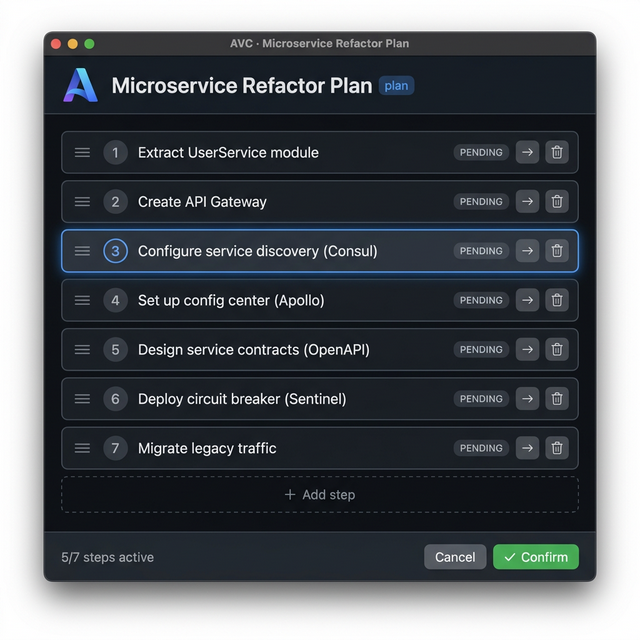

<p align="center">
  <h1 align="center">👁️ AVC — Agent View Controller</h1>
  <p align="center">
    <strong>The Visual Dimension Elevator in Unix Pipes</strong><br/>
    <em>Agent outputs JSON in → Human's visual decision JSON out</em>
  </p>
  <p align="center">
    <a href="./README_CN.md">中文</a> · English
  </p>
</p>

---

## The Problem

AI Agents (Codex CLI, Claude Code, Cursor, Gemini CLI...) are **blazing fast** in the terminal. They read code, generate plans, and execute commands at machine speed.

But when they need **human approval** — a refactoring plan, an architecture change, a multi-step deployment — they dump walls of text into the terminal. Humans are forced to read 50+ lines of monospace text, mentally parse the structure, and type "yes" or "no."

**This is insane.** Humans are visual creatures. Our brains process images 60,000× faster than text.

## The Solution

AVC is a **3MB single binary** that does one thing perfectly:

```bash
echo '{"view":"plan","data":{...}}' | avc
```

1. Reads JSON from `stdin`
2. Pops up a native WebView window with a beautiful interactive UI
3. Human drags, edits, reorders — making decisions visually
4. Outputs modified JSON to `stdout`
5. Window closes. Agent continues.

**Like `fzf` gave CLI users interactive selection, AVC gives all CLI agents visual interaction.**

```
Traditional pipe:   agent | grep | jq | awk       (text processing)
AVC pipe:           agent | avc                    (visual processing)
```

## Quick Start

### Install

**One-line install** (builds binary + installs skills for all detected agents):

```bash
curl -sSL https://raw.githubusercontent.com/study8677/Agent_View_Controller-AVC/main/install.sh | bash
```

<details>
<summary>Manual install</summary>

```bash
git clone https://github.com/study8677/Agent_View_Controller-AVC.git
cd Agent_View_Controller-AVC
go build -o avc .
sudo cp avc /usr/local/bin/

# Install skill for your agent
cp -r skills/avc/ ~/.codex/skills/avc/    # Codex CLI
cp -r skills/avc/ ~/.claude/skills/avc/   # Claude Code
cp -r skills/avc/ ~/.gemini/skills/avc/   # Gemini CLI
```

</details>

### Try It

```bash
cat examples/execution-plan.json | ./avc
```

A native window pops up:

<p align="center">
  
</p>

Drag steps to reorder, edit text, skip steps, add new ones, then click **✅ Confirm** — the modified JSON appears in your terminal.

## Usage Examples

### Example 1: Database Migration Plan

```bash
echo '{
  "view": "plan",
  "title": "Database Migration v3 → v4",
  "editable": true,
  "data": {
    "steps": [
      {"id": 1, "label": "Backup production database", "status": "pending"},
      {"id": 2, "label": "Run migration scripts on staging", "status": "pending"},
      {"id": 3, "label": "Verify data integrity checks", "status": "pending"},
      {"id": 4, "label": "Switch DNS to maintenance page", "status": "pending"},
      {"id": 5, "label": "Execute production migration", "status": "pending"},
      {"id": 6, "label": "Run smoke tests", "status": "pending"},
      {"id": 7, "label": "Remove maintenance page", "status": "pending"}
    ]
  }
}' | ./avc
```

> 💡 Human can reorder steps (e.g., move smoke tests before DNS switch), skip backup if already done, or add a "Notify team on Slack" step.

### Example 2: API Refactoring Plan

```bash
echo '{
  "view": "plan",
  "title": "REST → GraphQL Migration",
  "editable": true,
  "data": {
    "steps": [
      {"id": 1, "label": "Set up GraphQL server with Apollo", "status": "pending"},
      {"id": 2, "label": "Define schema types for User, Post, Comment", "status": "pending"},
      {"id": 3, "label": "Implement resolvers with existing service layer", "status": "pending"},
      {"id": 4, "label": "Add authentication middleware", "status": "pending"},
      {"id": 5, "label": "Set up DataLoader for N+1 prevention", "status": "pending"},
      {"id": 6, "label": "Write integration tests", "status": "pending"},
      {"id": 7, "label": "Deploy with REST fallback route", "status": "pending"},
      {"id": 8, "label": "Deprecate REST endpoints", "status": "pending"}
    ]
  }
}' | ./avc
```

### Example 3: Capture and Use the Result

```bash
# Agent captures the human-approved plan
RESULT=$(cat examples/execution-plan.json | ./avc)

if [ $? -eq 0 ]; then
  echo "✅ Human approved:"
  echo "$RESULT" | jq '.data.steps[] | select(.skipped != true) | .label'
  # Agent proceeds to execute only the approved, non-skipped steps
else
  echo "❌ Human cancelled the plan"
fi
```

## Supported Views

| View Type | Description | Interaction | Status |
|-----------|-------------|-------------|--------|
| `plan` | Execution plans / step lists | Drag to reorder, edit, skip, add/delete | ✅ Ready |
| `graph` | Architecture topology | Drag nodes, edit connections | 🚧 Coming |
| `diff` | Code diff review | Accept/reject per line | 🚧 Planned |
| `table` | Data tables | Edit cells, sort columns | 🚧 Planned |

## JSON Schema

```json
{
  "view": "plan",
  "title": "Microservice Refactor Plan",
  "editable": true,
  "token_count": 4500,
  "data": {
    "steps": [
      { "id": 1, "label": "Extract UserService", "status": "pending" },
      { "id": 2, "label": "Create API Gateway", "status": "pending" },
      { "id": 3, "label": "Configure service discovery", "status": "pending" }
    ]
  },
  "actions": ["confirm", "cancel"]
}
```

> Note: `token_count` is optional. If omitted, AVC estimates from byte length.

## 🎚️ Token Threshold

AVC has a built-in **smart filter**: only when the content exceeds a token threshold (default: **3000 tokens**) will the WebView window pop up. Short content passes through directly without interrupting the human.

### How It Works

```
stdin JSON ──→ AVC reads ──→ Check token count
                              │
                   ≤ 3K token │ > 3K token
                      ↓               ↓
              Output to stdout    Pop up WebView
              (pass-through)      Interactive review
```

- If the JSON contains a `token_count` field → use that value
- Otherwise → estimate from byte length (`bytes / 3`)
- If token count ≤ threshold → pass-through (exit code `0`, original JSON on stdout)

### CLI Options

```bash
# Always show WebView (bypass threshold)
echo '<json>' | avc --no-threshold

# Set a custom threshold
echo '<json>' | avc --threshold=5000
```

### Include Token Count in JSON (Recommended)

For accurate control, have the Agent include `token_count` in the JSON:

```json
{
  "view": "plan",
  "title": "Your Plan",
  "token_count": 4500,
  "data": { "steps": [...] }
}
```


## Using AVC with AI Agents

AVC is **agent-agnostic** — it works with any AI coding agent that can execute shell commands.

### ⭐ Method 1: Install as a Skill (Recommended)

The easiest way. Copy the skill folder into your agent's skills directory — works globally across all projects:

```bash
# For Gemini CLI / Antigravity
cp -r skills/avc/ ~/.gemini/skills/avc/

# For any project with a skills/ directory
cp -r skills/avc/ your-project/skills/avc/
```

Once installed, the agent **automatically knows** when and how to use AVC. No per-project configuration needed.

### Method 2: Per-Project Config Files

### With OpenAI Codex CLI

Add the included `AGENTS.md` to your project root (already provided in this repo).

```markdown
## Visual Decision Tool

When you generate a complex execution plan (>3 steps), architecture change,
or multi-file refactoring plan, output it as AVC-compatible JSON and pipe
it through `avc` for human visual review:

    echo '{"view":"plan","title":"...","data":{"steps":[...]}}' | avc

The command blocks until the human confirms. Capture stdout to get the
human-modified plan, then execute accordingly.
```

Then Codex will automatically use AVC when it generates complex plans:

```bash
# Codex generates a plan → pipes to AVC → waits for human → continues
echo '{"view":"plan","title":"Refactor Auth Module","data":{"steps":[
  {"id":1,"label":"Extract auth middleware","status":"pending"},
  {"id":2,"label":"Create JWT service","status":"pending"},
  {"id":3,"label":"Update route handlers","status":"pending"},
  {"id":4,"label":"Add integration tests","status":"pending"}
]}}' | avc
```

### With Claude Code

In your project's `CLAUDE.md` or system prompt:

```markdown
## AVC Integration

For complex execution plans, use the `avc` visual tool instead of
printing plain text. Construct a JSON object with view type and data,
then pipe it through `avc`:

    echo '<json>' | avc

This opens a visual UI for the human to review and modify the plan.
The modified JSON is returned via stdout. Wait for it before proceeding.
```

### With Cursor (AI IDE)

In Cursor's terminal, AVC works as a standard Unix pipe tool. Configure via `.cursorrules`:

```markdown
## Visual Planning

When generating multi-step plans, use `avc` for visual human review:
1. Construct plan as JSON with view:"plan" schema
2. Run: echo '<json>' | avc
3. Read stdout for the human-approved plan
4. Execute the approved steps
```

### With Any Agent

The pattern is universal — **any** tool that can:
1. Write JSON to a process's stdin
2. Read the process's stdout
3. Wait for the process to exit

...can use AVC. It's just a Unix pipe.

## Design Philosophy

| Principle | Description |
|-----------|-------------|
| **Agent is CPU, AVC is Display** | Agents do the thinking. AVC does the showing. |
| **Agent-agnostic** | Works with Codex, Claude, Gemini, Cursor, or any CLI tool |
| **Unix Philosophy** | stdin in, stdout out. Compose with any pipe |
| **Zero Dependencies** | Single binary. Uses system-native WebView |
| **< 100ms Startup** | Native binary, no Node.js / npm overhead |

## Tech Stack

- **Go** + [webview/webview_go](https://github.com/webview/webview_go) — system-native WebView bindings
- **Vanilla JS** — embedded via `go:embed`, zero frontend dependencies
- **macOS**: WKWebView · **Linux**: WebKitGTK · **Windows**: WebView2

## Architecture

```
        ┌──────────┐     stdin      ┌──────────┐     render     ┌──────────┐
        │ AI Agent │ ──── JSON ───→ │   AVC    │ ────────────→  │ WebView  │
        │ (Codex,  │                │ (3MB Go  │                │ (Native  │
        │  Claude, │ ←── JSON ────  │  Binary) │ ←── confirm ─  │  Window) │
        │  Cursor) │     stdout     └──────────┘     callback   └──────────┘
        └──────────┘                                              ↕ Human
```

## Roadmap

AVC's vision is to become the **universal visual layer** for all CLI agents. Every type of structured data an agent produces should have a beautiful, interactive view.

### Phase 1 — Foundations ✅

| View | What Agent Outputs | What Human Sees | Status |
|------|--------------------|-----------------|--------|
| `plan` | Steps with order & status | Draggable step list with edit/skip/delete | ✅ Done |

### Phase 2 — Core Views 🚧

| View | What Agent Outputs | What Human Sees |
|------|--------------------|------------------|
| `graph` | Nodes + edges (services, modules) | Interactive topology — drag nodes, edit labels, add/remove connections |
| `diff` | File paths + hunks | Side-by-side diff with per-line Accept / Reject / Edit |
| `table` | Rows + columns | Sortable, filterable, editable data grid |

### Phase 3 — Rich Visual Content 🔮

| View | What Agent Outputs | What Human Sees |
|------|--------------------|------------------|
| `tree` | File/directory structure | Interactive file tree — rename, move, create, delete |
| `timeline` | Events with timestamps | Gantt-chart-style timeline — drag to adjust scheduling |
| `kanban` | Cards with columns | Kanban board — drag cards between columns |
| `form` | Fields + validation rules | Multi-step wizard form — fill in configs, select options |
| `mindmap` | Hierarchical ideas | Expandable mind map — restructure by dragging branches |

### Phase 4 — Advanced Visualization 🌟

| View | What Agent Outputs | What Human Sees |
|------|--------------------|------------------|
| `metrics` | Numbers + time series | Live dashboard with charts and gauges |
| `flow` | Pipeline stages + conditions | CI/CD flow diagram — reorder stages, toggle gates |
| `compare` | Multiple options with pros/cons | Side-by-side comparison cards — vote & rank |
| `3d-graph` | Complex dependency graphs | 3D force-directed graph — rotate, zoom, filter |

> **The goal**: Any structured JSON → one `| avc` → instant visual interaction. No more reading walls of terminal text.

## Contributing

Contributions welcome! We especially need help with:

- **New view types** — Pick any from the roadmap above and implement it
- **UI polish** — Animations, themes, accessibility
- **Platform testing** — Linux (WebKitGTK) and Windows (WebView2)
- **Agent integration examples** — Show how AVC works with different agents

## License

Apache 2.0
