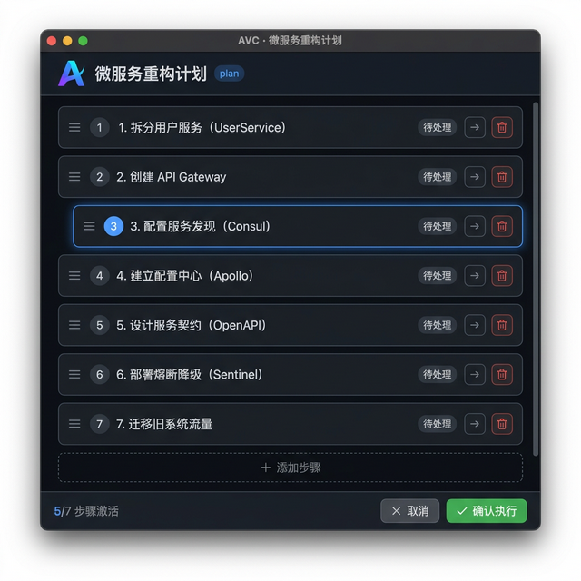

<p align="center">
  <h1 align="center">👁️ AVC — Agent View Controller</h1>
  <p align="center">
    <strong>Unix 管道中的「视觉升维器」</strong><br/>
    <em>Agent 输出 JSON 进去，人类的视觉决策 JSON 出来</em>
  </p>
  <p align="center">
    中文 · <a href="./README.md">English</a>
  </p>
</p>

---

## 🧠 为什么需要 AVC？

AI Agent（Codex CLI、Claude Code、Cursor、Gemini CLI……）在终端里**又快又强**。它们读代码、生成方案、执行命令，速度是人类的 100 倍。

但当它们需要**人类拍板**时 —— 一个重构计划、一个架构变更、一个多步部署方案 —— 它们只会在终端里倒出 50 行等宽文字。人类被迫一行行阅读，在脑中重建结构，然后输入 "yes" 或 "no"。

**这太反人类了。**

> 对 Agent 而言，CLI 模式又快又好。
> 但对人类而言，**视觉才拥有更高的信息密度。**

人脑处理图像的速度是处理文字的 **60,000 倍**。为什么不把 Agent 的输出「升维」成可视化的交互界面，让人类用最擅长的方式做决策？

**这就是 AVC 做的事。**

## ✨ 它是什么？

AVC 是一个 **3MB 的单二进制文件**，它做一件极其简单的事情：

```bash
echo '{"view":"plan","data":{...}}' | avc
```

1. 📥 从 `stdin` 读入 JSON
2. 🖼️ 弹出原生 WebView 窗口，渲染出美观的交互式 UI
3. 🖱️ 人类在窗口中拖拽、编辑、拍板
4. 📤 把修改后的 JSON 输出到 `stdout`
5. 💨 窗口关闭，Agent 继续执行

**像 `fzf` 给了 CLI 用户「交互式选择」的能力，AVC 给了所有 CLI Agent「视觉交互」的能力。**

```
传统 CLI 管道:   agent | grep | jq | awk       (文字处理)
AVC 管道:        agent | avc                    (视觉处理)
```

## 🚀 快速开始

### 安装

```bash
# 从源码编译
git clone https://github.com/study8677/Agent_View_Controller-AVC.git
cd Agent_View_Controller-AVC
go build -o avc .

# 可选：加到 PATH
sudo cp avc /usr/local/bin/
```

### 试一试

```bash
cat examples/execution-plan.json | ./avc
```

一个原生窗口弹出：

<p align="center">
  
</p>

你可以拖拽步骤排序、编辑文字、跳过步骤、添加新步骤，然后点击 **✅ 确认执行** —— 修改后的 JSON 出现在终端。

## 📖 使用示例

### 示例 1：数据库迁移计划

```bash
echo '{
  "view": "plan",
  "title": "数据库迁移 v3 → v4",
  "editable": true,
  "data": {
    "steps": [
      {"id": 1, "label": "备份生产数据库", "status": "pending"},
      {"id": 2, "label": "在 staging 环境执行迁移脚本", "status": "pending"},
      {"id": 3, "label": "验证数据完整性", "status": "pending"},
      {"id": 4, "label": "切换 DNS 到维护页面", "status": "pending"},
      {"id": 5, "label": "执行生产环境迁移", "status": "pending"},
      {"id": 6, "label": "运行冒烟测试", "status": "pending"},
      {"id": 7, "label": "撤除维护页面", "status": "pending"}
    ]
  }
}' | ./avc
```

> 💡 人类可以：重排步骤顺序（比如把冒烟测试提前）、跳过已完成的备份、或者添加一个「在 Slack 通知团队」的新步骤。

### 示例 2：API 重构计划

```bash
echo '{
  "view": "plan",
  "title": "REST → GraphQL 迁移",
  "editable": true,
  "data": {
    "steps": [
      {"id": 1, "label": "搭建 Apollo GraphQL 服务", "status": "pending"},
      {"id": 2, "label": "定义 User/Post/Comment Schema", "status": "pending"},
      {"id": 3, "label": "实现 Resolver 对接现有服务层", "status": "pending"},
      {"id": 4, "label": "添加认证中间件", "status": "pending"},
      {"id": 5, "label": "配置 DataLoader 解决 N+1 问题", "status": "pending"},
      {"id": 6, "label": "编写集成测试", "status": "pending"},
      {"id": 7, "label": "部署并保留 REST 降级路由", "status": "pending"},
      {"id": 8, "label": "废弃 REST 端点", "status": "pending"}
    ]
  }
}' | ./avc
```

### 示例 3：捕获人类修改后的结果

```bash
# Agent 捕获人类批准的计划
RESULT=$(cat examples/execution-plan.json | ./avc)

if [ $? -eq 0 ]; then
  echo "✅ 人类已批准："
  echo "$RESULT" | jq '.data.steps[] | select(.skipped != true) | .label'
  # Agent 只执行批准的、未跳过的步骤
else
  echo "❌ 人类取消了计划"
fi
```

## 📊 支持的视图

| 视图类型 | 描述 | 交互方式 | 状态 |
|---------|------|---------|------|
| `plan` | 执行计划 / 步骤列表 | 拖拽排序、编辑内容、跳过/删除、添加新步骤 | ✅ 可用 |
| `graph` | 架构拓扑图 | 拖拽节点、编辑连线 | 🚧 开发中 |
| `diff` | 代码 Diff 审查 | 逐行 Accept/Reject | 🚧 计划中 |
| `table` | 数据表格 | 编辑单元格、排序 | 🚧 计划中 |

## 📐 JSON Schema

```json
{
  "view": "plan",
  "title": "微服务重构计划",
  "editable": true,
  "token_count": 4500,
  "data": {
    "steps": [
      { "id": 1, "label": "拆分用户服务", "status": "pending" },
      { "id": 2, "label": "创建 API Gateway", "status": "pending" },
      { "id": 3, "label": "配置服务发现", "status": "pending" }
    ]
  },
  "actions": ["confirm", "cancel"]
}
```

> 注：`token_count` 是可选字段。如果省略，AVC 会根据 JSON 字节长度自动估算。

## 🎚️ Token 阈值

AVC 内置**智能过滤机制**：仅当内容超过 token 阈值（默认：**3000 token**）时，才会弹出 WebView 窗口。短内容直接透传，不打断人类工作流。

### 工作原理

```
stdin JSON ──→ AVC 读取 ──→ 判断 token 数
                              │
                   ≤ 3K token │ > 3K token
                      ↓               ↓
               直接输出到 stdout    弹出 WebView
               （pass-through）     交互式审查
```

- 如果 JSON 包含 `token_count` 字段 → 使用该值
- 否则 → 根据字节长度估算（`字节数 / 3`）
- 如果 token 数 ≤ 阈值 → 透传模式（退出码 `0`，原始 JSON 输出到 stdout）

### CLI 参数

```bash
# 强制弹窗（跳过阈值判断）
echo '<json>' | avc --no-threshold

# 自定义阈值
echo '<json>' | avc --threshold=5000
```

### 在 JSON 中包含 Token 数（推荐）

为了精确控制，让 Agent 在 JSON 中传入 `token_count`：

```json
{
  "view": "plan",
  "title": "你的计划",
  "token_count": 4500,
  "data": { "steps": [...] }
}
```


## 🤖 与 AI Agent 集成

AVC 是 **Agent-agnostic（不绑定任何 Agent）** 的工具。任何能执行 shell 命令的 AI Agent 都能用它。

### ⭐ 方式一：安装为 Skill（推荐）

最简单的方式。把 skill 文件夹拷到你的 Agent 的 skills 目录——全局生效，无需每个项目单独配置：

```bash
# Gemini CLI / Antigravity
cp -r skills/avc/ ~/.gemini/skills/avc/

# 或者复制到任何项目的 skills/ 目录
cp -r skills/avc/ your-project/skills/avc/
```

安装后，Agent **自动知道**何时以及如何使用 AVC。无需额外配置。

### 方式二：每个项目单独配置

### 🔧 OpenAI Codex CLI

在项目根目录放入 `AGENTS.md`（本仓库已提供）。

```markdown
## 视觉决策工具

当你生成复杂的执行计划（>3 步骤）、架构变更或多文件重构方案时，
将其输出为 AVC 兼容的 JSON 并通过 `avc` 管道传给人类进行可视化审查：

    echo '{"view":"plan","title":"...","data":{"steps":[...]}}' | avc

命令会阻塞直到人类确认。捕获 stdout 获取人类修改后的计划，然后按计划执行。
```

Codex 会自动在生成复杂计划时使用 AVC：

```bash
# Codex 生成计划 → 管道传给 AVC → 等待人类 → 继续执行
echo '{"view":"plan","title":"重构认证模块","data":{"steps":[
  {"id":1,"label":"抽取认证中间件","status":"pending"},
  {"id":2,"label":"创建 JWT 服务","status":"pending"},
  {"id":3,"label":"更新路由处理器","status":"pending"},
  {"id":4,"label":"添加集成测试","status":"pending"}
]}}' | avc
```

### 💬 Claude Code

在项目的 `CLAUDE.md` 或系统提示中添加：

```markdown
## AVC 集成

当需要展示复杂执行计划时，使用 `avc` 可视化工具代替纯文本输出。
构造包含 view 类型和数据的 JSON 对象，通过管道传给 `avc`：

    echo '<json>' | avc

这会打开一个可视化 UI 让人类审查和修改计划。
修改后的 JSON 通过 stdout 返回。请等待返回后再继续。
```

### 🖱️ Cursor（AI IDE）

在 Cursor 的终端中，AVC 作为标准 Unix 管道工具使用。在 `.cursorrules` 中配置：

```markdown
## 可视化计划

生成多步骤计划时，使用 `avc` 进行可视化人类审查：
1. 构造符合 view:"plan" schema 的 JSON
2. 运行: echo '<json>' | avc
3. 读取 stdout 获取人类批准的计划
4. 执行批准的步骤
```

### 🌐 通用模式

核心模式非常简单 —— **任何**能做到以下三点的工具都能使用 AVC：

1. 把 JSON 写入一个进程的 stdin
2. 读取该进程的 stdout
3. 等待进程退出

它就是一个 Unix 管道工具。

## 💎 设计哲学

```
┌──────────────────────────────────────────────────────────────┐
│                                                              │
│   Agent 是 CPU ── 负责高速思考、生成、执行                     │
│   AVC 是显示器 ── 负责将信息升维为视觉，供人类直觉判断           │
│                                                              │
│   暗线（机器的归机器）：Agent 在终端里高速处理 JSON/代码          │
│   明线（人类的归人类）：AVC 将复杂信息瞬间升维为可交互图形         │
│                                                              │
│   终端负责「动手的极速执行」                                    │
│   AVC 负责「动脑的极速降维」                                    │
│                                                              │
└──────────────────────────────────────────────────────────────┘
```

| 原则 | 说明 |
|------|------|
| **Agent 是 CPU，AVC 是显示器** | Agent 负责思考，AVC 负责展示 |
| **Agent-agnostic** | 不绑定任何 Agent，Codex / Claude / Gemini / Cursor 都能用 |
| **Unix 哲学** | stdin 进、stdout 出，可与任何管道工具组合 |
| **零依赖** | 单二进制，使用系统原生 WebView |
| **< 100ms 启动** | 原生二进制，无 Node.js / npm 开销 |

## 🏗️ 架构

```
        ┌──────────┐     stdin      ┌──────────┐     render     ┌──────────┐
        │ AI Agent │ ──── JSON ───→ │   AVC    │ ────────────→  │ WebView  │
        │ (Codex,  │                │ (3MB Go  │                │ (Native  │
        │  Claude, │ ←── JSON ────  │  Binary) │ ←── confirm ─  │  Window) │
        │  Cursor) │     stdout     └──────────┘     callback   └──────────┘
        └──────────┘                                              ↕ 人类
```

## 🛠️ 技术栈

- **Go** + [webview/webview_go](https://github.com/webview/webview_go) — 系统原生 WebView 绑定
- **Vanilla JS** — 通过 `go:embed` 嵌入，零前端依赖
- **macOS**: WKWebView · **Linux**: WebKitGTK · **Windows**: WebView2

## 🗺️ 路线图

AVC 的愿景是成为所有 CLI Agent 的**通用视觉层**。Agent 产出的每一种结构化数据，都应该有对应的美观交互视图。

### Phase 1 — 基础 ✅

| 视图 | Agent 输出什么 | 人类看到什么 | 状态 |
|------|--------------|------------|------|
| `plan` | 步骤列表 + 状态 | 可拖拽排序的步骤卡片，支持编辑/跳过/删除 | ✅ 完成 |

### Phase 2 — 核心视图 🚧

| 视图 | Agent 输出什么 | 人类看到什么 |
|------|--------------|------------|
| `graph` | 节点 + 连线（服务、模块） | 交互式拓扑图 — 拖拽节点、编辑标签、增删连线 |
| `diff` | 文件路径 + 代码块 | 并排 Diff — 逐行 Accept / Reject / 编辑 |
| `table` | 行 + 列数据 | 可排序、可过滤、可编辑的数据表格 |

### Phase 3 — 丰富视觉内容 🔮

| 视图 | Agent 输出什么 | 人类看到什么 |
|------|--------------|------------|
| `tree` | 文件/目录结构 | 交互式文件树 — 重命名、移动、创建、删除 |
| `timeline` | 事件 + 时间戳 | 甘特图式时间线 — 拖拽调整排期 |
| `kanban` | 卡片 + 列 | 看板 — 在列之间拖拽卡片 |
| `form` | 字段 + 校验规则 | 多步向导表单 — 填写配置、选择选项 |
| `mindmap` | 层级化想法 | 可展开的思维导图 — 拖拽分支重组结构 |

### Phase 4 — 高级可视化 🌟

| 视图 | Agent 输出什么 | 人类看到什么 |
|------|--------------|------------|
| `metrics` | 数值 + 时序数据 | 实时仪表盘 — 图表、仪表、指标卡 |
| `flow` | 流水线阶段 + 条件 | CI/CD 流程图 — 重排阶段、切换开关 |
| `compare` | 多个方案 + 优劣分析 | 并排对比卡片 — 投票 & 排名 |
| `3d-graph` | 复杂依赖关系图 | 3D 力导向图 — 旋转、缩放、过滤 |

> **终极目标**：任何结构化 JSON → 一个 `| avc` → 瞬间获得视觉交互。不再阅读大段终端文字。

## 🤝 贡献

欢迎贡献！我们特别需要：

- **新视图类型** — 从上面路线图中选一个实现
- **UI 打磨** — 动画、主题、无障碍访问
- **平台测试** — Linux（WebKitGTK）和 Windows（WebView2）
- **Agent 集成示例** — 展示 AVC 如何与不同 Agent 配合

## 📄 License

Apache 2.0
